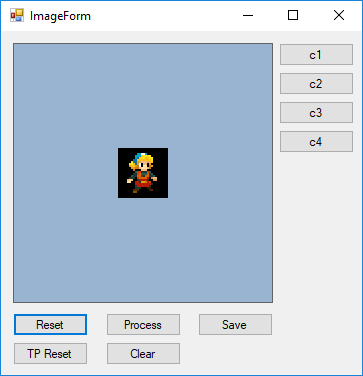
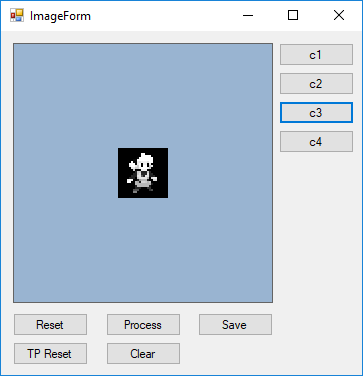
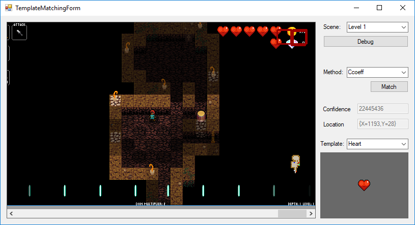
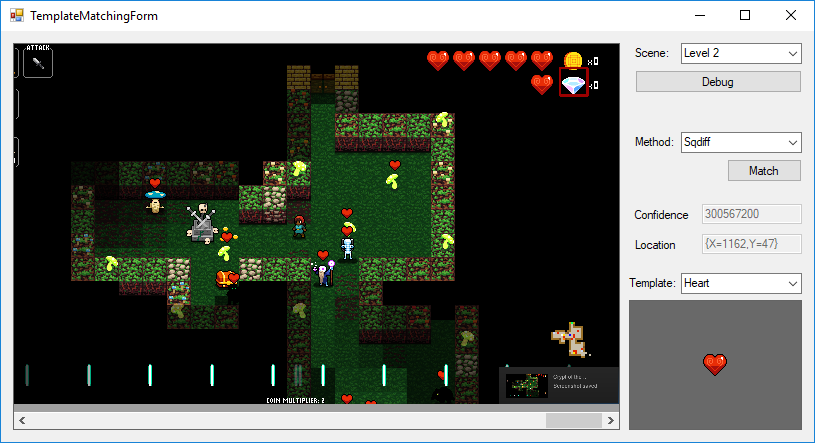

# Emgu Playground
This is a project created to experiment OpenCV library.
The objective was to try using feature matching functionality to find the UI component of a screenshot of the game, [Crypt of the Necrodancer](http://necrodancer.com/).

I own the game and the sprites are included, thus I just copied and pasted in the project folders, however due to copyright issues, I have excluded them from the git.

#### Summary
At the very beginning, beforing diving into template matching, I thought the template should be transparent, so I have implemented a __ImageForm__ that would remove the background color, and make the image transparent.

After that, I have tried playing with the _template matching_ function and implemented __TemplateMatchingForm__, however the result was not very statisfying.

And realizing learning OpenCV while writing C# code isn't really effecient, I am ditching this project for now, and head over to [another repo] to learn OpenCV in Python.

## ImageForm
##### Before background removal

##### After background removal

##### Image channels
Each button on the right side of the image selects a BGRA channel and display the image for that channel only. This image shows the red channel of the image.

## TemplateMatchingForm
I think I spent more time implementing the form than playing with Emgu APIs...
The input of this forms are the dropdownlists:
- Scene (the image to be match by a template)
- Template (the image to be match with a scene)
- Method (Different template matching methods provided by Emgu)

The method ddl allowed me to quickly test each and every method and see if any of them brings better result. However, the matches are really off (see the image below).

And writing winForm isn't the most efficient way to play with OpenCV, LET'S GO PYTHON!

#### Scene 1

#### Scene 2

